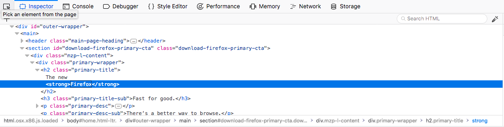
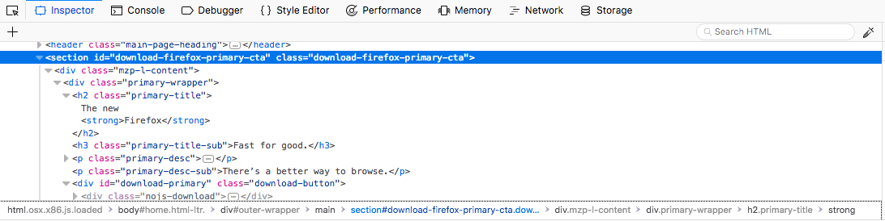

Breadcrumbs are a navigational element that reveal the user’s location in a hierarchy.

## Usage

In Firefox developer tools, breadcrumbs place the user in the site's DOM scheme. Breadcrumbs also reveal the styles associated with an element, via id, class, or pseudo-class.

## Style

By default, the currently selected element on the page is highlighted in breadcrumbs

Element: Grey 60 `#4a4a4f`

Id or class: `#909090`

Selected element: Blue 55 `#0074e8`

The user can select another element or style in the inspector.

Element: Blue 55 `#0074e8`

Id or class: Blue 70 `#003eaa`
